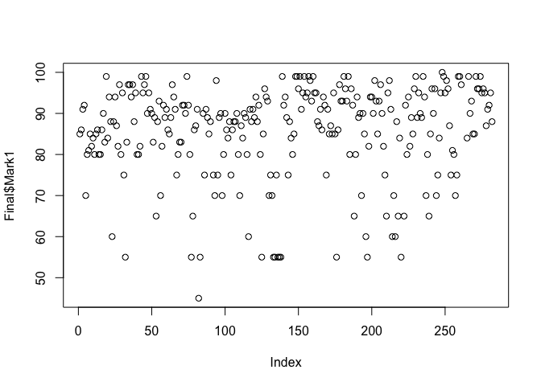
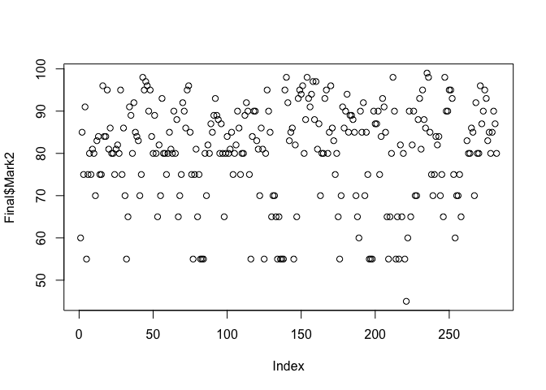
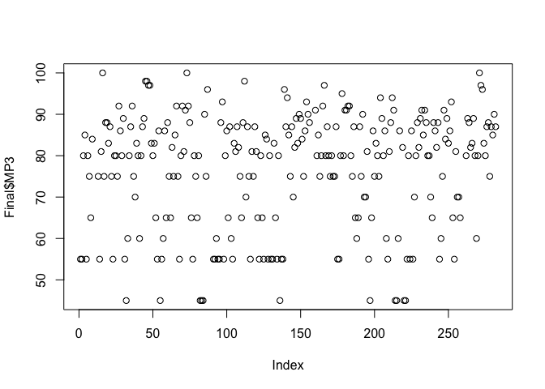
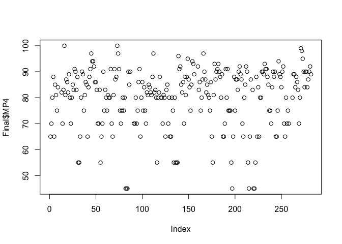

SPARK in Staten Island
================
Evaluated on behalf of Borough Hall and New Dorp High School by Fil Babalievsky and Atishay Sehgal

Introduction
============

This is a replication file for Babalievsky and Sehgal (2018), an evaluation of Project SPARK.

Preliminaries
=============

First we load prerequisite pack and set our working directory to the path with the data (not a local file--we cannot store the data in a public repo.)

``` r
setwd("~/Dropbox/New SI Stuff/SPARK Eval")
knitr::opts_knit$set(root.dir = "~/Dropbox/New SI Stuff/SPARK Eval")
#install.packages("tidyverse")
#install.packages("stargazer")
#install.packages("Rcurl")
#install.packages("readxl")
library(tidyverse)
```

    ## ── Attaching packages ────────────────────────────────── tidyverse 1.2.1 ──

    ## ✔ ggplot2 2.2.1     ✔ purrr   0.2.5
    ## ✔ tibble  1.4.2     ✔ dplyr   0.7.6
    ## ✔ tidyr   0.8.1     ✔ stringr 1.2.0
    ## ✔ readr   1.1.1     ✔ forcats 0.3.0

    ## ── Conflicts ───────────────────────────────────── tidyverse_conflicts() ──
    ## ✖ dplyr::filter() masks stats::filter()
    ## ✖ dplyr::lag()    masks stats::lag()

``` r
library(dplyr)
library(stargazer)
```

    ## 
    ## Please cite as:

    ##  Hlavac, Marek (2018). stargazer: Well-Formatted Regression and Summary Statistics Tables.

    ##  R package version 5.2.2. https://CRAN.R-project.org/package=stargazer

``` r
library(RCurl)
```

    ## Loading required package: bitops

    ## 
    ## Attaching package: 'RCurl'

    ## The following object is masked from 'package:tidyr':
    ## 
    ##     complete

``` r
library(readxl)
```

Next we import a function for clustered standard errors.

``` r
# import the function from repository
# thanks https://economictheoryblog.com/2016/12/13/clustered-standard-errors-in-r/
url_robust <- "https://raw.githubusercontent.com/IsidoreBeautrelet/economictheoryblog/master/robust_summary.R"
eval(parse(text = getURL(url_robust, ssl.verifypeer = FALSE)),
     envir=.GlobalEnv)
```

The Data
========

First we import data for the ninth graders in the Health Sciences SLC in New Dorp High who are enrolled in SPARK. Note that there are 57 students in SPARK and 37 students in New Dorp's 9th grade class not in SPARK. The seventh tab of the Excel file holds data for SPARK students in their first marking periods in English, math, and science. There are 171 observations, 3 classes times 51 students.

``` r
hs_spark_1<-read_excel("SPARK 2017 HN copy.xlsx", sheet = 7, col_names = FALSE)
```

    ## Warning in strptime(x, format, tz = tz): unknown timezone 'default/America/
    ## New_York'

``` r
names(hs_spark_1)<-c("StudentID", "Course", "Mark1")

nrow(hs_spark_1)
```

    ## [1] 171

``` r
#dummy for Spark participation
hs_spark_1$Spark<-1
#dummy for New Dorp High School students
hs_spark_1$HS<-1
```

Next we import data for ninth graders who are in the Health Sciences SLC in New Dorp High School but not in SPARK. There are 111 observations, 3 classes times 37 students.

``` r
hs_nonspark_1<-read_excel("SPARK 2017 HN copy.xlsx", sheet = 8, col_names = FALSE)
names(hs_nonspark_1)<-c("StudentID", "Course", "Mark1")
#dummy for SPARK non-participation
hs_nonspark_1$Spark<-0
#dummy for New Dorp High School Students
hs_nonspark_1$HS<-1
nrow(hs_nonspark_1)
```

    ## [1] 111

Here we combine the results from the first marking period with those of the second marking period.

``` r
first<-rbind(hs_spark_1, hs_nonspark_1)


all_mp_2<-read_excel("SPARK MP2 Grades copy.xlsx", sheet = 1)
names(all_mp_2)
```

    ## [1] "StudentID" "Course"    "Mark"

``` r
names(all_mp_2)<-c("StudentID", "Course", "Mark2")

#total<-merge(first, all_mp_2, by=c("StudentID", "Course"))
total<-left_join(first, all_mp_2, by=c("StudentID", "Course"))

total$diff<-as.numeric(as.character(total$Mark2))-as.numeric(as.character(total$Mark1))
```

    ## Warning: NAs introduced by coercion

``` r
total_hs<-total[total$HS==1,]
nrow(total_hs[total_hs$Spark==0,])
```

    ## [1] 111

``` r
nrow(total_hs[total_hs$Spark==1,])
```

    ## [1] 171

Next we look at the data from marking periods 3 and 4 and try to merge them with the data from periods 1 and 2.

``` r
three_and_four_again<-read_excel("SPARK 2017 Term 2 MP3 and MP4 copy.xlsx", sheet = 1)
names(three_and_four_again)<-c("StudentID", "Blank1", "Blank2",  "Course", "Blank3", "Blank4", "Blank5", "Blank6", "MP3", "MP4", "Final")

total_hs<-total[total$HS==1,]
total_hs$firsfour<-substr(total_hs$Course, 1, 4)
total_hs$lastthree<-substr(total_hs$Course, 6, 8)
total_hs$Course<-paste(total_hs$firsfour, total_hs$lastthree, sep="2")
nrow(total_hs)
```

    ## [1] 282

``` r
Final<-left_join(total_hs, three_and_four_again, by=c("StudentID", "Course"))
nrow(Final)
```

    ## [1] 282

``` r
nrow(Final[Final$Spark==0,])
```

    ## [1] 111

``` r
nrow(Final[Final$Spark==1,])
```

    ## [1] 171

``` r
Final$Final <- NULL

is.numeric(Final$Mark1)
```

    ## [1] FALSE

``` r
is.numeric(Final$MP4)
```

    ## [1] FALSE

``` r
is.numeric(Final$MP3)
```

    ## [1] FALSE

``` r
is.numeric(Final$MP4)
```

    ## [1] FALSE

Next we run our regressions. All our observations are at the student-subject level. The first three regressions have the following format:

Δ=α+β×SPARK

Here Δ is the difference in grades for a student-subject between marking period 1 and a subsequent marking period, α is a constant, and β is the coefficient on a dummy variable taking value 1 if and only if the student is in SPARK. The next three regressions have the format:

Δ=α+∑<sub>i</sub>(β<sub>i</sub>×SPARK×Class<sub>i</sub>)+∑<sub>i</sub>(γ<sub>i</sub>×Class<sub>i</sub>)

Here, γ is the coefficient on a specific subject--Math, English, or Science. A high value for, say γ<sub>m</sub>, the coefficient on math, tells us that student performance declined less in math than in the "default" subject (here chosen as science.) A high value for β<sub>m</sub> would therefore imply that students in SPARK saw even smaller decreases in math performance than non-SPARK students.

``` r
Final$diff1<-as.numeric(as.character(Final$Mark2))-as.numeric(as.character(Final$Mark1))
```

    ## Warning: NAs introduced by coercion

``` r
Final$diff2<-as.numeric(as.character(Final$MP3))-as.numeric(as.character(Final$Mark1))
```

    ## Warning: NAs introduced by coercion

``` r
Final$diff3<-as.numeric(as.character(Final$MP4))-as.numeric(as.character(Final$Mark1))
```

    ## Warning: NAs introduced by coercion

``` r
summary(Final$diff1)
```

    ##    Min. 1st Qu.  Median    Mean 3rd Qu.    Max.    NA's 
    ## -29.000  -9.000  -5.000  -4.905   0.000  23.000       9

``` r
lm1<-lm(diff1~Spark,data=Final)
summary(lm1)
```

    ## 
    ## Call:
    ## lm(formula = diff1 ~ Spark, data = Final)
    ## 
    ## Residuals:
    ##      Min       1Q   Median       3Q      Max 
    ## -25.0059  -4.0059   0.3846   3.9941  26.9941 
    ## 
    ## Coefficients:
    ##             Estimate Std. Error t value Pr(>|t|)    
    ## (Intercept)  -6.3846     0.7333  -8.707 3.13e-16 ***
    ## Spark         2.3905     0.9320   2.565   0.0109 *  
    ## ---
    ## Signif. codes:  0 '***' 0.001 '**' 0.01 '*' 0.05 '.' 0.1 ' ' 1
    ## 
    ## Residual standard error: 7.478 on 271 degrees of freedom
    ##   (9 observations deleted due to missingness)
    ## Multiple R-squared:  0.0237, Adjusted R-squared:  0.0201 
    ## F-statistic: 6.579 on 1 and 271 DF,  p-value: 0.01086

``` r
summary(lm1, cluster=c("StudentID"))
```

    ## 
    ## Call:
    ## lm(formula = diff1 ~ Spark, data = Final)
    ## 
    ## Residuals:
    ##      Min       1Q   Median       3Q      Max 
    ## -25.0059  -4.0059   0.3846   3.9941  26.9941 
    ## 
    ## Coefficients:
    ##             Estimate Std. Error t value Pr(>|t|)
    ## (Intercept)   -6.385         NA      NA       NA
    ## Spark          2.391         NA      NA       NA
    ## 
    ## Residual standard error: 7.478 on 271 degrees of freedom
    ##   (9 observations deleted due to missingness)
    ## Multiple R-squared:  0.0237, Adjusted R-squared:  0.0201 
    ## F-statistic:   NaN on 1 and 0 DF,  p-value: NA

``` r
lm2<-lm(diff2~Spark,data=Final)
summary(lm2)
```

    ## 
    ## Call:
    ## lm(formula = diff2 ~ Spark, data = Final)
    ## 
    ## Residuals:
    ##     Min      1Q  Median      3Q     Max 
    ## -39.713  -6.165   0.835   7.287  24.835 
    ## 
    ## Coefficients:
    ##             Estimate Std. Error t value Pr(>|t|)    
    ## (Intercept)  -8.8350     0.9733  -9.077   <2e-16 ***
    ## Spark         0.5475     1.2479   0.439    0.661    
    ## ---
    ## Signif. codes:  0 '***' 0.001 '**' 0.01 '*' 0.05 '.' 0.1 ' ' 1
    ## 
    ## Residual standard error: 9.878 on 261 degrees of freedom
    ##   (19 observations deleted due to missingness)
    ## Multiple R-squared:  0.0007368,  Adjusted R-squared:  -0.003092 
    ## F-statistic: 0.1925 on 1 and 261 DF,  p-value: 0.6612

``` r
lm3<-lm(diff3~Spark,data=Final)
summary(lm3)
```

    ## 
    ## Call:
    ## lm(formula = diff3 ~ Spark, data = Final)
    ## 
    ## Residuals:
    ##     Min      1Q  Median      3Q     Max 
    ## -33.413  -4.192   0.029   4.587  24.587 
    ## 
    ## Coefficients:
    ##             Estimate Std. Error t value Pr(>|t|)    
    ## (Intercept)  -6.0291     0.7667  -7.864 9.86e-14 ***
    ## Spark         1.4416     0.9829   1.467    0.144    
    ## ---
    ## Signif. codes:  0 '***' 0.001 '**' 0.01 '*' 0.05 '.' 0.1 ' ' 1
    ## 
    ## Residual standard error: 7.781 on 261 degrees of freedom
    ##   (19 observations deleted due to missingness)
    ## Multiple R-squared:  0.008174,   Adjusted R-squared:  0.004374 
    ## F-statistic: 2.151 on 1 and 261 DF,  p-value: 0.1437

``` r
Final$coursechar<-as.character(Final$Course)
Final$Type<-substr(Final$coursechar, 1, 1)


Final$Spark_math<-0
Final$Spark_math[Final$Spark==1&Final$Type=="M"]<-1

Final$Spark_sci<-0
Final$Spark_sci[Final$Spark==1&Final$Type=="S"]<-1

Final$Spark_eng<-0
Final$Spark_eng[Final$Spark==1&Final$Type=="E"]<-1

Final$math<-0
Final$math[Final$Type=="M"]<-1

Final$sci<-0
Final$sci[Final$Type=="S"]<-1

Final$eng<-0
Final$eng[Final$Type=="E"]<-1


lm1_subj<-lm(diff1~Spark_math+Spark_sci+Spark_eng+math+eng,data=Final)
summary(lm1_subj)
```

    ## 
    ## Call:
    ## lm(formula = diff1 ~ Spark_math + Spark_sci + Spark_eng + math + 
    ##     eng, data = Final)
    ## 
    ## Residuals:
    ##      Min       1Q   Median       3Q      Max 
    ## -24.6429  -3.8214   0.1786   3.7059  25.4737 
    ## 
    ## Coefficients:
    ##             Estimate Std. Error t value Pr(>|t|)    
    ## (Intercept)  -8.0857     1.2577  -6.429  5.9e-10 ***
    ## Spark_math    3.2322     1.6124   2.005   0.0460 *  
    ## Spark_sci     2.9071     1.6033   1.813   0.0709 .  
    ## Spark_eng     0.9857     1.6033   0.615   0.5392    
    ## math          2.3798     1.7917   1.328   0.1852    
    ## eng           2.7429     1.7787   1.542   0.1242    
    ## ---
    ## Signif. codes:  0 '***' 0.001 '**' 0.01 '*' 0.05 '.' 0.1 ' ' 1
    ## 
    ## Residual standard error: 7.441 on 267 degrees of freedom
    ##   (9 observations deleted due to missingness)
    ## Multiple R-squared:  0.04771,    Adjusted R-squared:  0.02987 
    ## F-statistic: 2.675 on 5 and 267 DF,  p-value: 0.02224

``` r
summary(lm1_subj, cluster=c("StudentID"))
```

    ## 
    ## Call:
    ## lm(formula = diff1 ~ Spark_math + Spark_sci + Spark_eng + math + 
    ##     eng, data = Final)
    ## 
    ## Residuals:
    ##      Min       1Q   Median       3Q      Max 
    ## -24.6429  -3.8214   0.1786   3.7059  25.4737 
    ## 
    ## Coefficients:
    ##             Estimate Std. Error t value Pr(>|t|)
    ## (Intercept)  -8.0857         NA      NA       NA
    ## Spark_math    3.2322         NA      NA       NA
    ## Spark_sci     2.9071         NA      NA       NA
    ## Spark_eng     0.9857         NA      NA       NA
    ## math          2.3798         NA      NA       NA
    ## eng           2.7429         NA      NA       NA
    ## 
    ## Residual standard error: 7.441 on 267 degrees of freedom
    ##   (9 observations deleted due to missingness)
    ## Multiple R-squared:  0.04771,    Adjusted R-squared:  0.02987 
    ## F-statistic:   NaN on 5 and 0 DF,  p-value: NA

``` r
lm2_subj<-lm(diff2~Spark_math+Spark_sci+Spark_eng+math+eng,data=Final)
summary(lm2_subj)
```

    ## 
    ## Call:
    ## lm(formula = diff2 ~ Spark_math + Spark_sci + Spark_eng + math + 
    ##     eng, data = Final)
    ## 
    ## Residuals:
    ##     Min      1Q  Median      3Q     Max 
    ## -38.396  -5.396   0.333   5.252  23.604 
    ## 
    ## Coefficients:
    ##             Estimate Std. Error t value Pr(>|t|)    
    ## (Intercept)  -3.3714     1.5492  -2.176 0.030452 *  
    ## Spark_math    0.2778     2.0251   0.137 0.891008    
    ## Spark_sci     0.2394     1.9963   0.120 0.904656    
    ## Spark_eng     1.3962     1.9963   0.699 0.484924    
    ## math         -8.9619     2.2239  -4.030 7.36e-05 ***
    ## eng          -7.6286     2.1909  -3.482 0.000585 ***
    ## ---
    ## Signif. codes:  0 '***' 0.001 '**' 0.01 '*' 0.05 '.' 0.1 ' ' 1
    ## 
    ## Residual standard error: 9.165 on 257 degrees of freedom
    ##   (19 observations deleted due to missingness)
    ## Multiple R-squared:  0.153,  Adjusted R-squared:  0.1365 
    ## F-statistic: 9.282 on 5 and 257 DF,  p-value: 3.854e-08

``` r
summary(lm2_subj, cluster=c("StudentID"))
```

    ## 
    ## Call:
    ## lm(formula = diff2 ~ Spark_math + Spark_sci + Spark_eng + math + 
    ##     eng, data = Final)
    ## 
    ## Residuals:
    ##     Min      1Q  Median      3Q     Max 
    ## -38.396  -5.396   0.333   5.252  23.604 
    ## 
    ## Coefficients:
    ##             Estimate Std. Error t value Pr(>|t|)
    ## (Intercept)  -3.3714         NA      NA       NA
    ## Spark_math    0.2778         NA      NA       NA
    ## Spark_sci     0.2394         NA      NA       NA
    ## Spark_eng     1.3962         NA      NA       NA
    ## math         -8.9619         NA      NA       NA
    ## eng          -7.6286         NA      NA       NA
    ## 
    ## Residual standard error: 9.165 on 257 degrees of freedom
    ##   (19 observations deleted due to missingness)
    ## Multiple R-squared:  0.153,  Adjusted R-squared:  0.1365 
    ## F-statistic:   NaN on 5 and 0 DF,  p-value: NA

``` r
lm3_subj<-lm(diff3~Spark_math+Spark_sci+Spark_eng+math+eng,data=Final)
summary(lm3_subj)
```

    ## 
    ## Call:
    ## lm(formula = diff3 ~ Spark_math + Spark_sci + Spark_eng + math + 
    ##     eng, data = Final)
    ## 
    ## Residuals:
    ##     Min      1Q  Median      3Q     Max 
    ## -32.113  -4.560  -0.463   4.368  25.887 
    ## 
    ## Coefficients:
    ##             Estimate Std. Error t value Pr(>|t|)   
    ## (Intercept) -3.42857    1.30296  -2.631  0.00902 **
    ## Spark_math   2.85690    1.70323   1.677  0.09469 . 
    ## Spark_sci    0.08895    1.67894   0.053  0.95779   
    ## Spark_eng    1.45606    1.67894   0.867  0.38661   
    ## math        -3.96537    1.87038  -2.120  0.03496 * 
    ## eng         -3.91429    1.84267  -2.124  0.03460 * 
    ## ---
    ## Signif. codes:  0 '***' 0.001 '**' 0.01 '*' 0.05 '.' 0.1 ' ' 1
    ## 
    ## Residual standard error: 7.708 on 257 degrees of freedom
    ##   (19 observations deleted due to missingness)
    ## Multiple R-squared:  0.04149,    Adjusted R-squared:  0.02284 
    ## F-statistic: 2.225 on 5 and 257 DF,  p-value: 0.05233

``` r
summary(lm3_subj, cluster=c("StudentID"))
```

    ## 
    ## Call:
    ## lm(formula = diff3 ~ Spark_math + Spark_sci + Spark_eng + math + 
    ##     eng, data = Final)
    ## 
    ## Residuals:
    ##     Min      1Q  Median      3Q     Max 
    ## -32.113  -4.560  -0.463   4.368  25.887 
    ## 
    ## Coefficients:
    ##             Estimate Std. Error t value Pr(>|t|)
    ## (Intercept) -3.42857         NA      NA       NA
    ## Spark_math   2.85690         NA      NA       NA
    ## Spark_sci    0.08895         NA      NA       NA
    ## Spark_eng    1.45606         NA      NA       NA
    ## math        -3.96537         NA      NA       NA
    ## eng         -3.91429         NA      NA       NA
    ## 
    ## Residual standard error: 7.708 on 257 degrees of freedom
    ##   (19 observations deleted due to missingness)
    ## Multiple R-squared:  0.04149,    Adjusted R-squared:  0.02284 
    ## F-statistic:   NaN on 5 and 0 DF,  p-value: NA

We next run three regressions, again with subject dummies, but this time we compare performance between:

-   Marking period 2 and 3
-   Marking period 3 and 4
-   Marking period 2 and 4

``` r
Final$diff_intermediate1<-as.numeric(as.character(Final$MP3))-as.numeric(as.character(Final$Mark2))
lm_intermediate1<-lm(diff_intermediate1~Spark_math+Spark_sci+Spark_eng+math+eng,data=Final)
summary(lm_intermediate1)
```

    ## 
    ## Call:
    ## lm(formula = diff_intermediate1 ~ Spark_math + Spark_sci + Spark_eng + 
    ##     math + eng, data = Final)
    ## 
    ## Residuals:
    ##      Min       1Q   Median       3Q      Max 
    ## -30.9259  -4.8056   0.5833   5.8286  22.0741 
    ## 
    ## Coefficients:
    ##             Estimate Std. Error t value Pr(>|t|)    
    ## (Intercept)    4.806      1.472   3.264  0.00124 ** 
    ## Spark_math    -3.783      1.917  -1.973  0.04949 *  
    ## Spark_sci     -2.880      1.901  -1.515  0.13092    
    ## Spark_eng     -0.287      1.901  -0.151  0.88006    
    ## math         -10.634      2.097  -5.072 7.45e-07 ***
    ## eng          -10.389      2.082  -4.990 1.10e-06 ***
    ## ---
    ## Signif. codes:  0 '***' 0.001 '**' 0.01 '*' 0.05 '.' 0.1 ' ' 1
    ## 
    ## Residual standard error: 8.833 on 263 degrees of freedom
    ##   (13 observations deleted due to missingness)
    ## Multiple R-squared:  0.2472, Adjusted R-squared:  0.2329 
    ## F-statistic: 17.27 on 5 and 263 DF,  p-value: 8.895e-15

``` r
Final$diff_intermediate2<-as.numeric(as.character(Final$MP4))-as.numeric(as.character(Final$MP3))
lm_intermediate2<-lm(diff_intermediate2~Spark_math+Spark_sci+Spark_eng+math+eng,data=Final)
summary(lm_intermediate2)
```

    ## 
    ## Call:
    ## lm(formula = diff_intermediate2 ~ Spark_math + Spark_sci + Spark_eng + 
    ##     math + eng, data = Final)
    ## 
    ## Residuals:
    ##      Min       1Q   Median       3Q      Max 
    ## -12.5185  -3.5556   0.0278   2.4815  20.2037 
    ## 
    ## Coefficients:
    ##             Estimate Std. Error t value Pr(>|t|)    
    ## (Intercept) -0.02778    0.74732  -0.037 0.970378    
    ## Spark_math   2.86138    0.97301   2.941 0.003566 ** 
    ## Spark_sci   -0.17593    0.96478  -0.182 0.855450    
    ## Spark_eng    0.37037    0.96478   0.384 0.701369    
    ## math         4.68492    1.06439   4.402 1.56e-05 ***
    ## eng          3.58333    1.05686   3.391 0.000805 ***
    ## ---
    ## Signif. codes:  0 '***' 0.001 '**' 0.01 '*' 0.05 '.' 0.1 ' ' 1
    ## 
    ## Residual standard error: 4.484 on 263 degrees of freedom
    ##   (13 observations deleted due to missingness)
    ## Multiple R-squared:  0.2852, Adjusted R-squared:  0.2717 
    ## F-statistic: 20.99 on 5 and 263 DF,  p-value: < 2.2e-16

``` r
Final$diff_ends<-as.numeric(as.character(Final$MP4))-as.numeric(as.character(Final$Mark2))
lm_ends<-lm(diff_ends~Spark_math+Spark_sci+Spark_eng+math+eng,data=Final)
summary(lm_ends)
```

    ## 
    ## Call:
    ## lm(formula = diff_ends ~ Spark_math + Spark_sci + Spark_eng + 
    ##     math + eng, data = Final)
    ## 
    ## Residuals:
    ##      Min       1Q   Median       3Q      Max 
    ## -25.9074  -3.7222   0.9444   4.2222  17.0926 
    ## 
    ## Coefficients:
    ##             Estimate Std. Error t value Pr(>|t|)    
    ## (Intercept)  4.77778    1.16935   4.086 5.84e-05 ***
    ## Spark_math  -0.92116    1.52251  -0.605 0.545681    
    ## Spark_sci   -3.05556    1.50963  -2.024 0.043976 *  
    ## Spark_eng    0.08333    1.50963   0.055 0.956020    
    ## math        -5.94921    1.66548  -3.572 0.000421 ***
    ## eng         -6.80556    1.65371  -4.115 5.18e-05 ***
    ## ---
    ## Signif. codes:  0 '***' 0.001 '**' 0.01 '*' 0.05 '.' 0.1 ' ' 1
    ## 
    ## Residual standard error: 7.016 on 263 degrees of freedom
    ##   (13 observations deleted due to missingness)
    ## Multiple R-squared:  0.1101, Adjusted R-squared:  0.09319 
    ## F-statistic: 6.509 on 5 and 263 DF,  p-value: 1.001e-05

``` r
plot(Final$Mark1)
```

    ## Warning in xy.coords(x, y, xlabel, ylabel, log): NAs introduced by coercion



``` r
plot(Final$Mark2)
```



``` r
plot(Final$MP3)
```



``` r
plot(Final$MP4)
```



Next we look at the kids who left our sample after Marking Period 2. Note that the SPARK students who dropped out of the sample had high MP1 grades, and an MP1 to MP2 drop that was not unusually great. We do not know why they left the sample.

``` r
dropouts <- Final[which(is.na(Final$MP4)),]
dropouts
```

    ## # A tibble: 13 x 31
    ##    StudentID Course   Mark1 Spark    HS Mark2  diff firsfour lastthree
    ##        <dbl> <chr>    <chr> <dbl> <dbl> <chr> <dbl> <chr>    <chr>    
    ##  1 209232552 EES82QQN 84        1     1 80       -4 EES8     QQN      
    ##  2 209232552 MES22QQN 80        1     1 70      -10 MES2     QQN      
    ##  3 209232552 SLS22QQN 85        1     1 83       -2 SLS2     QQN      
    ##  4 214937344 EES82QQN 89        1     1 80       -9 EES8     QQN      
    ##  5 214937344 MES22QQN 85        1     1 87        2 MES2     QQN      
    ##  6 214937344 SLS22QQN 88        1     1 85       -3 SLS2     QQN      
    ##  7 215877192 EES82QQN 99        1     1 94       -5 EES8     QQN      
    ##  8 215877192 MES22QQN 98        1     1 97       -1 MES2     QQN      
    ##  9 215877192 SLS22QQN 93        1     1 88       -5 SLS2     QQN      
    ## 10 226514768 MES22QQN 65        0     1 65        0 MES2     QQN      
    ## 11 242223808 EES82QQN 99        0     1 <NA>     NA EES8     QQN      
    ## 12 242223808 MES22QQN 99        0     1 <NA>     NA MES2     QQN      
    ## 13 242223808 SLS22QQN 97        0     1 <NA>     NA SLS2     QQN      
    ## # ... with 22 more variables: Blank1 <chr>, Blank2 <dbl>, Blank3 <dbl>,
    ## #   Blank4 <dbl>, Blank5 <chr>, Blank6 <chr>, MP3 <chr>, MP4 <chr>,
    ## #   diff1 <dbl>, diff2 <dbl>, diff3 <dbl>, coursechar <chr>, Type <chr>,
    ## #   Spark_math <dbl>, Spark_sci <dbl>, Spark_eng <dbl>, math <dbl>,
    ## #   sci <dbl>, eng <dbl>, diff_intermediate1 <dbl>,
    ## #   diff_intermediate2 <dbl>, diff_ends <dbl>

``` r
as.numeric(dropouts$Mark2)-as.numeric(dropouts$Mark1)
```

    ##  [1]  -4 -10  -2  -9   2  -3  -5  -1  -5   0  NA  NA  NA

``` r
summary(as.numeric(dropouts$Mark2)-as.numeric(dropouts$Mark1))
```

    ##    Min. 1st Qu.  Median    Mean 3rd Qu.    Max.    NA's 
    ##  -10.00   -5.00   -3.50   -3.70   -1.25    2.00       3

``` r
summary(as.numeric(Final$Mark2)-as.numeric(Final$Mark1))
```

    ## Warning in summary(as.numeric(Final$Mark2) - as.numeric(Final$Mark1)): NAs
    ## introduced by coercion

    ##    Min. 1st Qu.  Median    Mean 3rd Qu.    Max.    NA's 
    ## -29.000  -9.000  -5.000  -4.905   0.000  23.000       9

``` r
mean(dropouts$diff)
```

    ## [1] NA

``` r
x<-Final[Final$StudentID=="226514768",]
x
```

    ## # A tibble: 3 x 31
    ##   StudentID Course Mark1 Spark    HS Mark2  diff firsfour lastthree Blank1
    ##       <dbl> <chr>  <chr> <dbl> <dbl> <chr> <dbl> <chr>    <chr>     <chr> 
    ## 1 226514768 EES82… 88        0     1 82       -6 EES8     QQN       1KN   
    ## 2 226514768 MES22… 65        0     1 65        0 MES2     QQN       <NA>  
    ## 3 226514768 SLS22… 84        0     1 80       -4 SLS2     QQN       1KN   
    ## # ... with 21 more variables: Blank2 <dbl>, Blank3 <dbl>, Blank4 <dbl>,
    ## #   Blank5 <chr>, Blank6 <chr>, MP3 <chr>, MP4 <chr>, diff1 <dbl>,
    ## #   diff2 <dbl>, diff3 <dbl>, coursechar <chr>, Type <chr>,
    ## #   Spark_math <dbl>, Spark_sci <dbl>, Spark_eng <dbl>, math <dbl>,
    ## #   sci <dbl>, eng <dbl>, diff_intermediate1 <dbl>,
    ## #   diff_intermediate2 <dbl>, diff_ends <dbl>

``` r
summary(Final$diff1)
```

    ##    Min. 1st Qu.  Median    Mean 3rd Qu.    Max.    NA's 
    ## -29.000  -9.000  -5.000  -4.905   0.000  23.000       9

``` r
write.csv(Final, file = "Final_Spark.csv")
```
